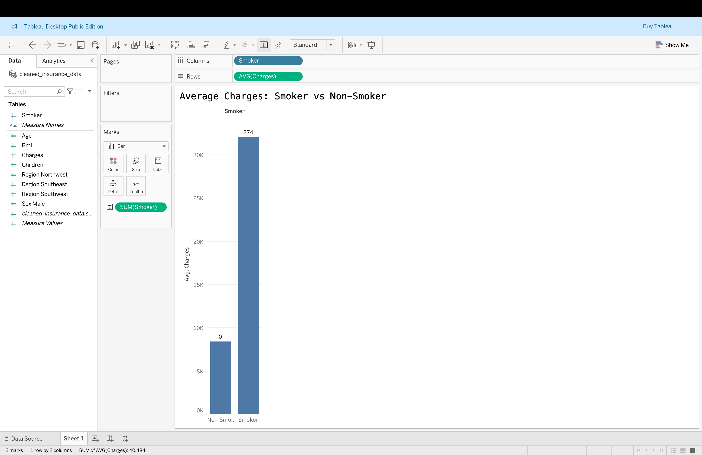
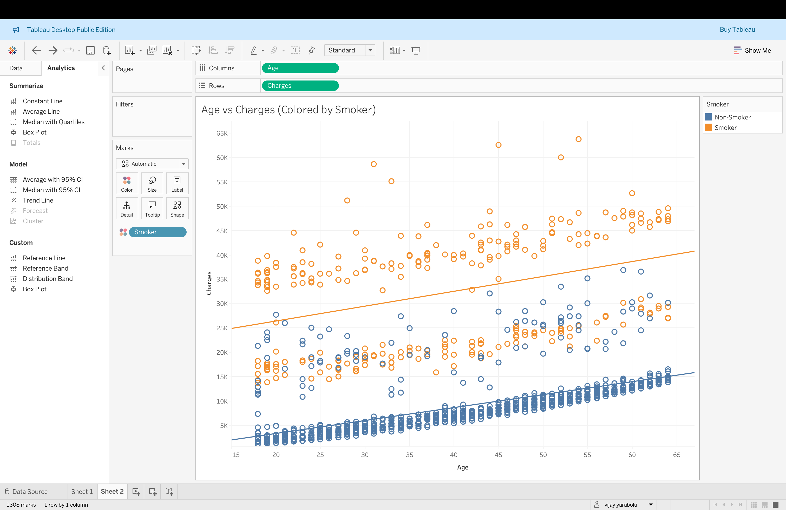

# 🏥 Medical Cost Prediction

This project predicts individual medical insurance charges using regression models. It includes data preprocessing, exploratory data analysis (EDA), multiple model training, and error comparison.

---

## 🔧 Tools & Technologies

- **Language**: Python
- **Notebook**: Jupyter
- **Libraries**: pandas, NumPy, seaborn, matplotlib, scikit-learn

---

## 📊 EDA Highlights

- Visualized how features like `age`, `bmi`, and `smoker` status influence `charges`
- Found clear spikes in charges for smokers
- Used pairplots, correlation heatmaps, and distribution plots

---

## 📊 Visual Insights (Tableau)

### 1. Average Charges: Smoker vs Non-Smoker


> Smokers are charged **2–3x more on average**, highlighting the cost impact of smoking.

---

### 2. Age vs Charges (Colored by Smoker)


> Charges increase with age, but smoking status creates **clear upward cost trends** even at younger ages.

---

## 🧠 Model Evaluation

| Model              | RMSE     | R² Score |
|-------------------|----------|----------|
| Linear Regression | 6060     | 0.75     |
| Lasso Regression  | 6170     | 0.74     |
| Random Forest     | 4300     | 0.86     ✅ Best

---

## 📁 Dataset

- 📍 Source: [Kaggle – Medical Cost Dataset](https://www.kaggle.com/datasets/mirichoi0218/insurance)
- Rows: 1,338
- Features:
  - `age`, `sex`, `bmi`, `children`, `smoker`, `region`, `charges`

---

## 🧠 What I Learned

- How smoking and BMI heavily impact cost
- How to compare regression models with RMSE and R²
- Importance of visual EDA before modeling

---

## 🗂 Folder Structure
```
Medical_Cost_Prediction/
├── images/
│ ├── eda_bmi_vs_charges.png
│ ├── smoker_cost_comparison.png
│
├── insurance.csv
├── Medical_Cost_Insurance.ipynb
├── README.md
├── LICENSE
```

---

## 📬 Connect

- [GitHub](https://github.com/vijayyarabolu)
- [LinkedIn](https://linkedin.com/in/vijayyarabolu)
